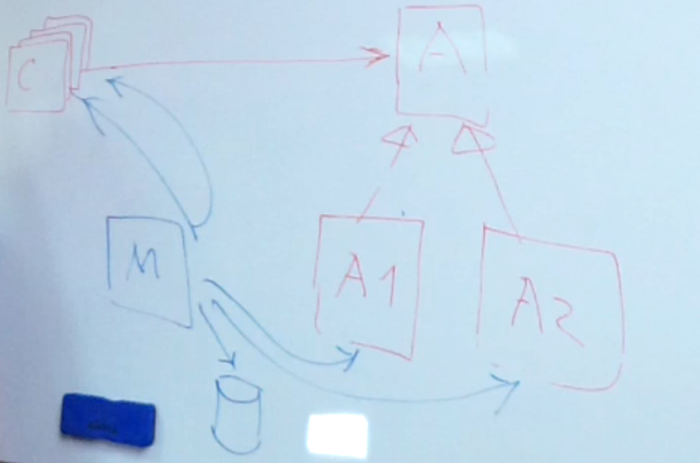

## Factory Method
### Проблема
Класс C использует классы A1 и A2 через интерфейс A.  
<b>Проблема:</b> класс C сам создаёт объекты классов A1 и A2, тем самым зависит от конкретных имплементаций.
> Проблема в синих стрелочках ☺

### Решение из GoF
Создать абстрактный класс или интерфейс Creator (Cr) и конкретные имплементации этого класса Cr1 и Cr2, которые будут создавать объекты типа A1 и A2, соответственно.
Каким-то образом (который не специфицируется) создастся конкретный инстенс класса Cr. 
Он будет создавать конкретные инстенсы A1 или A2.

> Проблема в том что всё равно где-то должен быть if, который создаст конкретный инстенс для Cr или A, вопрос лиш в том где?

### Решение 1
Если у нас много кода (не только в классе C, но и, условно, в клиентском коде), для которого требуется выбрать инстенс класса A, то получается что у нас одно и то же условие if для создания A будет размазано по всей системе.

Первое решение перенести метод создания конкретного класса A в абстрактный метод create класса Creator (Cr).
Но тогда в классах Cr1 и Cr2 практически не остаётся кода, и, как правило, их заменяют конструкцией IF.
Класс Cr становится утилитным, т.к. фактически его метод не требует хранения состояния, значит метод create может быть статическим.
 
Получим следующее решение:

> Заметка: вместо реального создания объекта, factory метод может возвращать уже существующий экземпляр.

### Решение 2
Перенести метод создания экземпляра в абстрактный класс A.

Это один из самых распространённых вариантов factory метода, 
но его проблема в том что возникают циклы на диаграмме. 
И, по сути, сам интерфейс или абстрактны класс становится зависим от своих наследников.

### Решение 3
С помощью DI

Некоторый класс Main (M) получает информацию о том какие классы нужно создать, и внедряет нужные объекты тем классам, которым они требуются.

Проблема только в высокой зависимости от DI фреймворка и нужно заняться мета-программированием (указание аннотаций над методами, либо написание отдельной конфигурации для движка DI).

### Использование Factory Method в JDK:

> Заметка: Другое название этого паттерна - виртуальный конструктор.

Наблюдения:

> Заметка: Плохо выбрасывать исключение из конструктора. Чтобы это не делать, лучше написать Factory Method и приватный конструктор.

