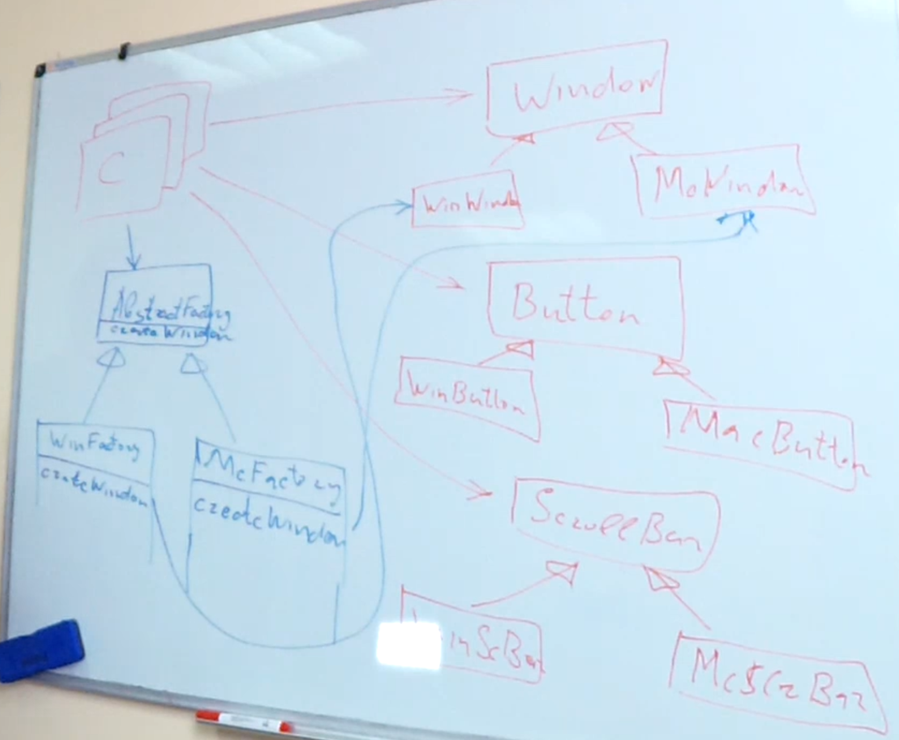

## Abstract Factory

Нужен когда в системе несть несколько групп объектов, в которой однотипные объекты из разных групп имплементируют один и тот же интерфейс. Все элементы группы используются вместе и создаются по какому-то определённому условию.

Фабрика содержит кучу factory методов, которые будут создавать сразу группы объектов.
Это полезно когда ось изменений проходит как раз через добавление новых конкретных групп, при этом количество объектов в каждой группе не меняется.
Иначе этот паттерн будет не очень эффективен. Так-как каждое изменение списка классов в группе потребует изменений во всех Abstract Factory реализациях.

Схема паттерна:
