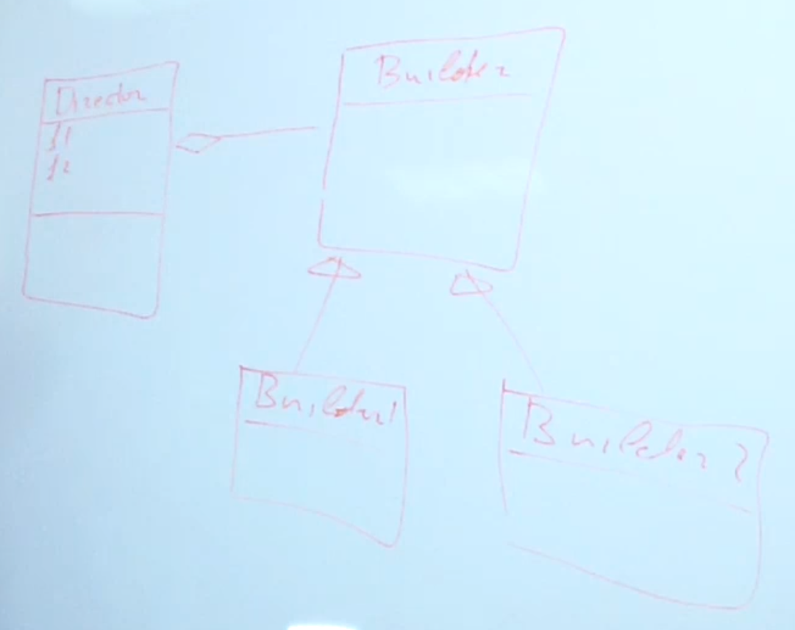

## Builder

### Проблема
Существуют сложные объекты, содержащие множество параметров, конструкторов, полей и методов с бизнес логикой.
Создание такого сложного объекта это тоже определённый процесс, который может быть достаточно сложным.
Из-за этого возникает ситуация, что объект отвечает за процесс создания самого себя (своего экземпляра) и за какую-то часть бизнес логики.
Эта двойная функциональность противоречит принципу SRP.
Для того чтобы решить эту проблему, используется паттерн Builder.

Builder позволяет вынести логику создания сложного объекта в отдельный класс.

Схема паттерна Builder: 

### Применимость
* Имеет смысл использовать шаблон Когда Алгоритм создания сложного объекта не должен зависеть от того из каких частей состоит объект и как эти части стыкуются между собой.
* Позволяет инкапсулировать всю логику создания объекта в одной иерархии классов - билдеров.
* Возможность поэтапного конструирования
* Сокрытие внутренней структуры от "клиента"
* Изменение процесса создания без изменения существующего кода

### Недостатки
* Накладывает дополнительные обязательства по тому из чего и как конкретно собирать объект на "клиента".

### Пример из JDK
StringBuilder