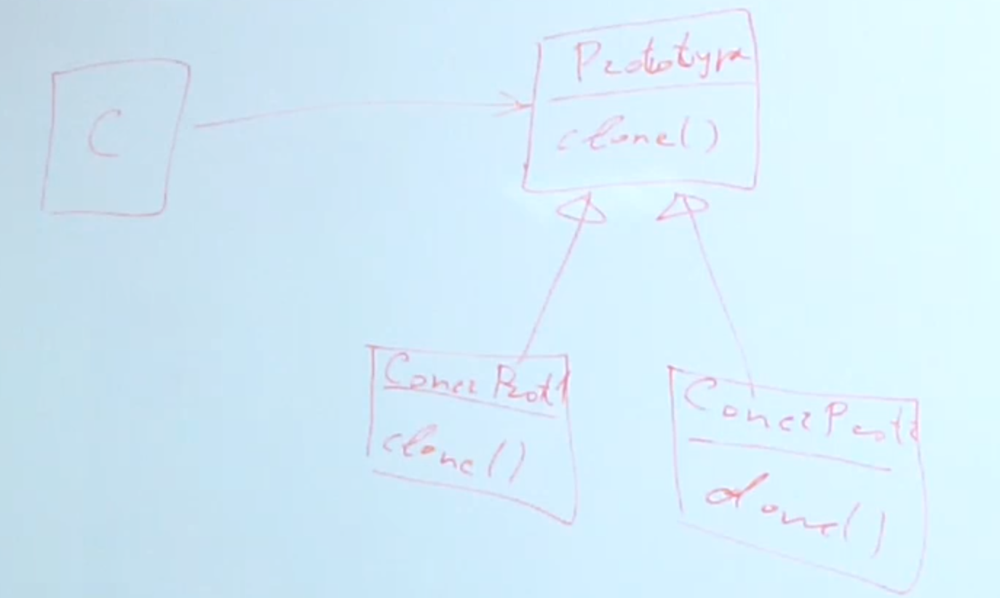

## Prototype

### Проблема
Порой бывает сложно создать новый экземпляр класса, если при его создании происходит сложная логика, требующая много ресурсов, для того чтобы инициализировать этот объект, либо когда объект может принимать только какое-то конечное (дискретное) количество состояний, которое гораздо меньше количества всего возможных состояний.

### Решение
Клонировать объект вместо создания через new

Схема паттерна:

Паттерн может быть удобно использовать, когда конкретный инстенс определяется в рантайме.

Можно сократить время на инициализацию.

Можно создать новый экземпляр в обход new ☺

### Недостатки:

* У прототипируемого объекта могут быть объектные поля.
В этом случаи нужно учитывать что по умолчанию java, как и многие языки, реализует поверхностное клонирование.
Это значит что у клонов будут ссылки на одинаковые объекты в полях при поверхностном клонировании.
* Глубокое клонирование нужно реализовывать отдельно.
* Циклические объекты нельзя клонировать.
* Нужно осторожно клонировать тяжёлые объекты, иначе может кончиться ОЗУ.

