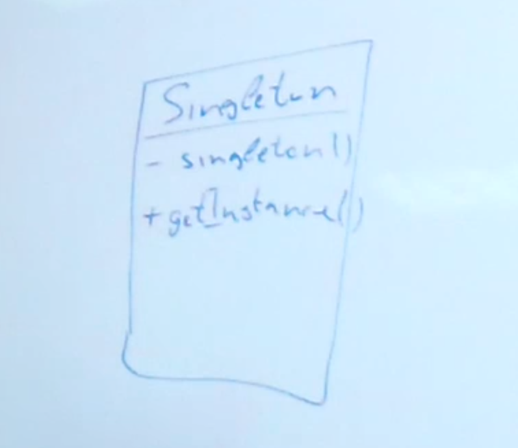

## Singleton

### Какую задачу решает?
Ограничить количество экземпляров какого-то класса.
В вырожденном случаи нужно создать только один экземпляр.

Схема паттерна:

Сингл тон является ещё и factory методом, ограничивающим количество экземпляров класса.

Применение в JDK:
java.lang.Runtime#getRuntime()
java.awt.Desktop#getDesktop()

