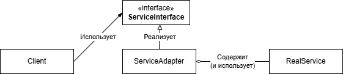
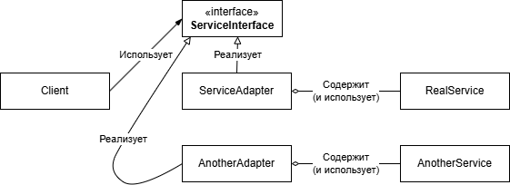

## Adapter
### Проблема

Существует какая-то библиотека или сервис, способные решить поставленную задачу, 
но их интерфейс по какой-то причине не подходит для нашей системы. 
Либо если мы хотим добавить уровень абстракции над этой библиотекой или сервисом и сделать нашу реализацию независимой от конкретной реализации библиотеки.

### Решение
Весь код, использующий вызовы библиотеки или сервиса выносится в отдельный класс, реализующий наш собственный интерфейс.
Этот класс, который реализует наш интерфейс и содержит вызовы библиотеки, называется **Адаптер**.

### Схема паттерна

Если версия библиотеки меняется, или меняется сервис, мы просто реализуем новый адаптер.

