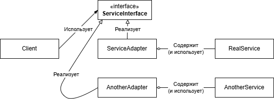

## Adapter
### Проблема

Существует какая-то библиотека или сервис, способные решить поставленную задачу, 
но их интерфейс по какой-то причине не подходит для нашей системы. 
Либо если мы хотим добавить уровень абстракции над этой библиотекой или сервисом и сделать нашу реализацию независимой от конкретной реализации библиотеки.

### Решение
Весь код, использующий вызовы библиотеки или сервиса выносится в отдельный класс, реализующий наш собственный интерфейс.
Этот класс, который реализует наш интерфейс и содержит вызовы библиотеки, называется **Адаптер**.

### Схема паттерна

Если версия библиотеки меняется, или меняется сервис, мы просто реализуем новый адаптер.

Ещё один вариант адаптера через наследование. В данном случаи оно не имеет смысла, так как адаптер по сути не является наследником сервиса, который он адаптирует, но такой подход может сократить написание кода.

### Задачка от gpt4:
**Задача**: 
Ты разрабатываешь систему управления оплатой в интернет-магазине. В твоей системе есть интерфейс для обработки платежей, который называется PaymentProcessor, с методом processPayment(double amount). Однако, магазин планирует интегрироваться с двумя внешними платёжными системами, у которых интерфейсы отличаются от твоего.

Первая система — это система PayPalPaymentService, которая имеет метод makePayment(String amountInDollars) (заметишь, что сумма передаётся как строка). 
Вторая система — это система StripePaymentService, у которой есть метод charge(double totalAmount, String currency), и она требует указания валюты при оплате (например, "USD"). 
Тебе нужно создать адаптеры для этих систем, чтобы они могли быть использованы в твоей системе через интерфейс PaymentProcessor. 

**Требования**: 
Создай интерфейс PaymentProcessor, который содержит метод processPayment(double amount). 
Реализуй адаптеры для классов PayPalPaymentService и StripePaymentService, которые приведут их к интерфейсу PaymentProcessor. 
Система должна быть способна обрабатывать платёж через любой из сервисов, используя единый интерфейс PaymentProcessor.