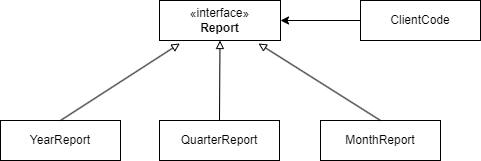
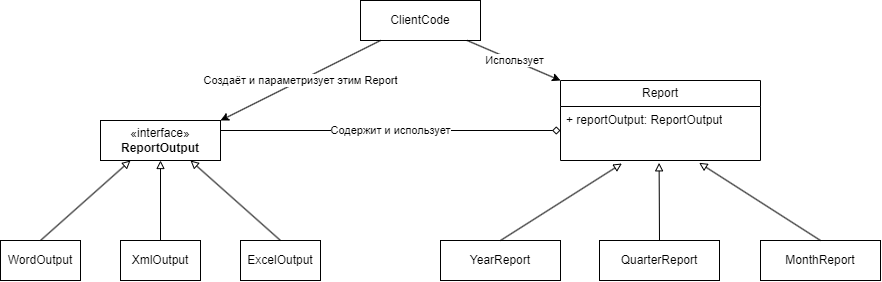

## Bridge

### Исходная ситуация

Существует несколько вариантов отчётов за разные временные промежутки.
Клиент использует все отчёты через общий интерфейс, как-то создаёт нужный ему вид отчёта и выводит каким-то единым способом.

### Проблема
Появилось требование выводить все существующие отчёты в разных форматах: MS Word, Excel, JSON, XML...

### Решение

Добавляем новую иерархию классов ReportOutput, а в базовом классе Report объявляем ссылку на абстрактный класс (или интерфейс) ReportOutput.
Все конкретные реализации Report будут использовать методы ReportOutput для своего вывода.

### Плюсы
* Позволяет разделить оси изменений для двух иерархий сущностей.
* Позволяет избежать комбинаторного взрыва.
* Отделяем абстракцию логики печати от логики вывода (форматирования вывода).

### Недостатки

* Неустойчивый. 
    * Н-р, если какой-то отчёт нужен только для одного типа вывода. Вместо реализации API использовали прямые вызовы и всё сломалось.
    * Или если какой-то специфичный отчёт требует особого вывода для определённого формата. Н-р, месячный отчёт хочет добавлять логотип компании при выводе в Word. Проверка на инстенс создаст прямую зависимость, чего мы пытаемся избежать. И паттерн ломается...
* Повышает сложность.
* Вызывает желание вызывать напрямую методы Интерфейса ReportOutput, хотя на самом деле правильно вызывать методы из класса Report, а уже абстрактный класс Report должен вызывать всё что нужно из класса ReportOutput.

<i> Этот Шаблон используется только когда есть строго две оси изменений. (или больше)</i>

<i>Родственные шаблоны: Abstract Factory, Adapter.</i>

[//]: # (TODO: Добавить пример в коде!)