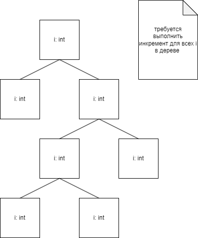
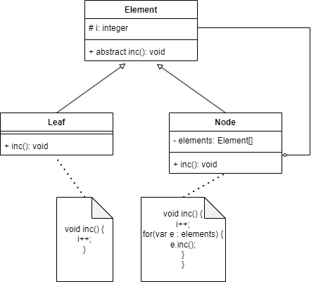

## Composite

Позволяет спрятать рекурсия в объектах. Создаёт дерево.

### Проблема
Есть задача инкрементировать все значения i во всех узлах.

Попробуем применить шаблон Composite.

С таким подходом мы вызываем только метод inc у корневого элемента.
Далее каждый элемент будет обработан одинаковым способом. 
Листья увеличат своё значение, узлы увеличат значение и вызовут метод inc у своих дочерних элементов (но не у себя как при рекурсии).

### Плюсы паттерна
* Этот паттерн идеально подходит для работы с древовидными структурами.
* Позволяет обходить деревья без явной рекурсии.

### Минусы паттерна
* Если в системе в дереве должны быть включены разнородные объекты, которые являются совсем разными.
* Если пытаться их привести к единому интерфейсу, мы получим неожиданное поведение в рантайме. 

### Задачка от GPT4

### Задача:
Ты разрабатываешь приложение для работы с каталогом товаров интернет-магазина. Товары в магазине могут быть двух типов:

Простые товары (например, смартфон, ноутбук), которые не содержат других товаров.
Композитные товары (например, набор электроники, в который входит смартфон, ноутбук, аксессуары), которые могут содержать как простые, так и другие композитные товары.
Тебе нужно реализовать каталог товаров с использованием паттерна Composite, чтобы можно было работать с любым товаром — как с простым, так и с набором товаров — через единый интерфейс.

### Требования:
1. Создай интерфейс Product, который будет определять методы для получения информации о товаре.
2. Реализуй класс для простых товаров.
3. Реализуй класс для композитных товаров, который может содержать список других товаров (как простых, так и композитных).
4. В системе должен быть метод для вывода полной информации о любом товаре (включая товары в наборах).
5. Композитные товары должны поддерживать добавление и удаление других товаров.