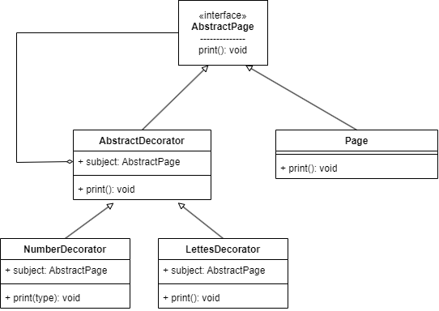
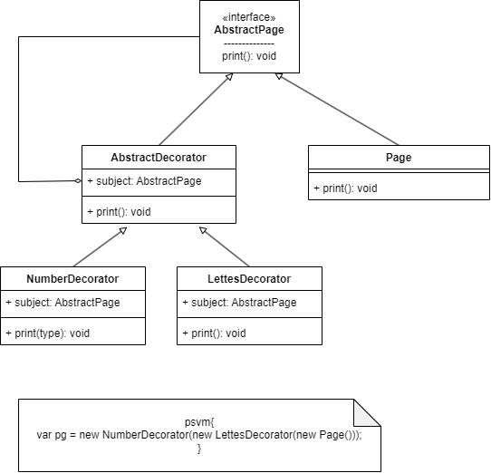

## Decorator

Позволяет добавить функциональность существующим классам (объектам классов) в рантайме (в процессе выполнения)

### Схема паттерна

С пояснением 

### Плюсы
* Паттерн сложный, а значит его тяжело сломать. В общем надёжный.
* Может подходить там где требуется какое-то сложное конфигурирование.
* Позволяет вынести делегирование основного класса в декораторы и использовать только необходимый набор методов без переопределения всех используемых.

### Минусы
* Код создания и передачи объектов внутрь других объектов плохо читается.
* Клиентский код должен понимать каким декоратором нужно декорировать нужный объект, чтобы получить нужный функционал.

### Примеры в Java
Классы из пакета io.*

### Родственные шаблоны:
Adapter, Proxy