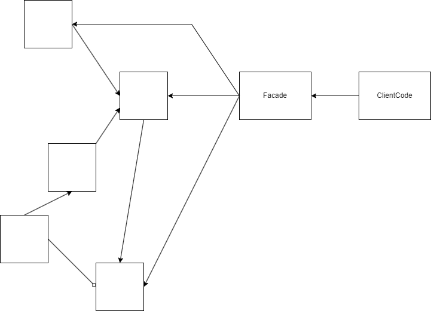

## Facade
Это такой класс, который берёт на себя всё взаимодействие с классами, содержащими нужную бизнес логику,
предоставляя клиентскому коду упрощённый интерфейс для работы с сервисами, инкапсулируя логику работы с сервисами системы,
и уменьшая связанность системы (low coupling).

### Схема паттерна

### Применимость
* Используется когда необходимо предоставить простой интерфейс к сложной системе.
* Смысл в том, чтобы разделить разные компоненты системы друг от друга. Модуль от модуля, систему от системы, леер от леера.

### Разница между Фасадом и Адаптером
Разница в масштабах.
Адаптер примерно равен по сложности тому коду, который он адаптирует. 
Цель Адаптера предоставить более удобный интерфейс клиентскому коду, не добавляя какой-то дополнительной обработки (только в рамках необходимого).
Фасад же предоставляет клиентскому коду всего несколько методов для работы со сложной системой в интерфейсе,
инкапсулируя бизнес логику работы с сервисами системы. Фасад может вызывать сотни методов разных классов и сервисов,
предоставляя клиентскому коду всего лиш 3-5 методов и, обычно, оборачивает результат в специальные DTO классы,
предоставляющие только данные без реализации бизнес логики.

### Родственные шаблоны
Abstract Factory, Singleton или MonoState, Mediator

<i> (MonoState - класс только со статическими полями и методами без своего собственного состояния, ну или общего для всех клиентов).</i>

### Задача от GPT
#### Задача:
Ты работаешь над системой бронирования поездок, которая взаимодействует с несколькими независимыми сервисами для организации поездки клиента. Каждый из этих сервисов имеет сложный и многослойный API. Задача состоит в том, чтобы упростить работу с этими сервисами, предоставив единую точку взаимодействия через фасад.

#### Условие:
Система должна бронировать:

Билеты на самолёт через сервис авиаперевозок.
Отель через сервис гостиниц.
Трансфер через сервис аренды автомобилей.
Каждый из этих сервисов имеет сложные интерфейсы и взаимодействует с множеством классов. Нужно реализовать класс TravelFacade, который предоставит простой интерфейс для бронирования всей поездки.

#### Подробности:
1. Сервис авиаперевозок предоставляет:

* Метод для поиска рейсов.
* Метод для бронирования билета на рейс.
* Метод для отмены брони.

2. Сервис гостиниц предоставляет:

* Метод для поиска доступных отелей.
* Метод для бронирования номера в отеле.
* Метод для отмены брони отеля.

3. Сервис аренды автомобилей предоставляет:

* Метод для поиска доступных автомобилей.
* Метод для бронирования автомобиля.
* Метод для отмены брони автомобиля.

#### Требования:
Создай классы для каждого сервиса (например, FlightBookingService, HotelBookingService, CarRentalService), которые будут предоставлять указанные методы.
Реализуй класс TravelFacade, который будет инкапсулировать всю логику взаимодействия с вышеуказанными сервисами и предоставлять простой интерфейс, например: bookTrip(String destination, Date startDate, Date endDate).
Фасад должен использовать существующие классы сервисов для выполнения бронирования рейсов, отелей и автомобилей, но скрывать их сложную логику.

Дополнительное требование:

Реализуй возможность отмены всей поездки через метод фасада, который отменит бронирование всех сервисов (авиабилеты, отель и аренду авто) в случае необходимости.

Цель:

Упрощение взаимодействия с несколькими сложными подсистемами (сервисами бронирования) через единый упрощённый интерфейс.