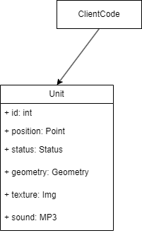

## Flyweight
### Проблема
Иногда возникает ситуация, когда один объект может хранить в себе очень большое количество данных, которые занимают довольно много места в оперативной памяти компьютера.
При этом у нас может появиться необходимость создавать несколько таких объектов такого типа.
Однако мы можем заметить что некоторая информация повторяется для разных объектов.
Например, если у нас в игре есть одинаковые игровые персонажи (юниты), у которых может быть одинаковый набор текстур, звуков, геометрии, но при этом разные id, координаты, состояния и т.д.

В этом случаи имеет смысл вынести общие тяжеловесные данные, общие для каждого юнита в отдельный класс, который будет общим для всех юнитов.

### Диаграмма проблемы

<br>Возникает при увеличении кол-ва объектов типа Unit

### Решение 1 вынести тяжелые данные в отдельный класс

<br>Выносим индивидуальные атрибуты юнита в отдельный класс SpecificUnit (класс легковес), а все общие тяжёлые элементы сохраняем в классе SharedUnit и клиентский код выбирает к какому объекту следует обратиться.

<b>Улучшение</b> - добавить фасад между классами юнитов и клиентским кодом, для того чтобы делегировать работу с классами юнитов фасаду, а клиентский код будет работать только с метаданными юнитов через DTO.

### Решение 2 добавить ссылку на общий класс для всех юнитов в класс SpecificUnit

<br>Делегируем обращения пользователя классу тяжеловесу, при необходимости.

### Преимущества
* Сокращение кол-ва экземпляров классов в процессе выполнения, экономия памяти.
* Централизованное хранение состояние многих объектов. (Полу виртуальные объекты)

### Недостатки
* Не получится основывать поведение индивидуального объекта-легковеса на основе состояния общего класса. 
* Это накладывает дополнительные ограничения и заставляет следить за тем какие поля мы выносим в общий класс.
* Для таких классов, чъё поведение основано на значениях полей общего класса, будет одинаковым для всех экземпляров.

### Родственные шаблоны
Abstract Factory


### Задача от GPT
#### Задача:
Ты работаешь над системой для создания виртуального леса. Лес состоит из множества деревьев, у каждого дерева есть уникальные координаты, но тип дерева (его внешние данные, такие как порода, цвет, текстура) могут повторяться. Для оптимизации использования памяти необходимо реализовать паттерн Flyweight, чтобы не дублировать одинаковую информацию для каждого дерева.

#### Условие:
Необходимо создать систему для размещения деревьев в лесу с использованием паттерна Flyweight. У каждого дерева должны быть:

* Внутренние данные (intrinsic state):
  * Тип дерева (порода дерева, цвет листвы, текстура коры). Эти данные повторяются у деревьев одного типа.

* Внешние данные (extrinsic state):
  * Координаты дерева (x, y). Эти данные уникальны для каждого экземпляра дерева.

#### Требуется:

* Реализовать класс TreeType, который будет хранить внутреннее состояние (тип дерева, цвет листвы, текстура коры).
* Реализовать класс Tree, который будет хранить внешние данные (координаты дерева) и ссылку на объект TreeType.
* Реализовать класс TreeFactory, который будет управлять созданием и хранением объектов TreeType. Если тип дерева уже существует, фабрика должна возвращать уже существующий объект, чтобы избежать дублирования.
* Реализовать клиентский код, который создаёт лес с различными деревьями, но оптимизирует память за счёт использования объектов TreeType через паттерн Flyweight.

Дополнительное требование:
В конце выведи, сколько уникальных типов деревьев было создано и общее количество деревьев, добавленных в лес.
<br>Цель:
Уменьшить использование памяти за счёт разделения общего состояния деревьев (тип дерева) и использования паттерна Flyweight для повторяющихся объектов.

Пример вывода:
```
Добавлено дерево: Oak, Цвет: Зеленый, Текстура: Шероховатая, Координаты: (10, 20)
Добавлено дерево: Pine, Цвет: Тёмно-зелёный, Текстура: Гладкая, Координаты: (30, 40)
Добавлено дерево: Oak, Цвет: Зеленый, Текстура: Шероховатая, Координаты: (50, 60)
Уникальные типы деревьев: 2
Всего деревьев: 3
```